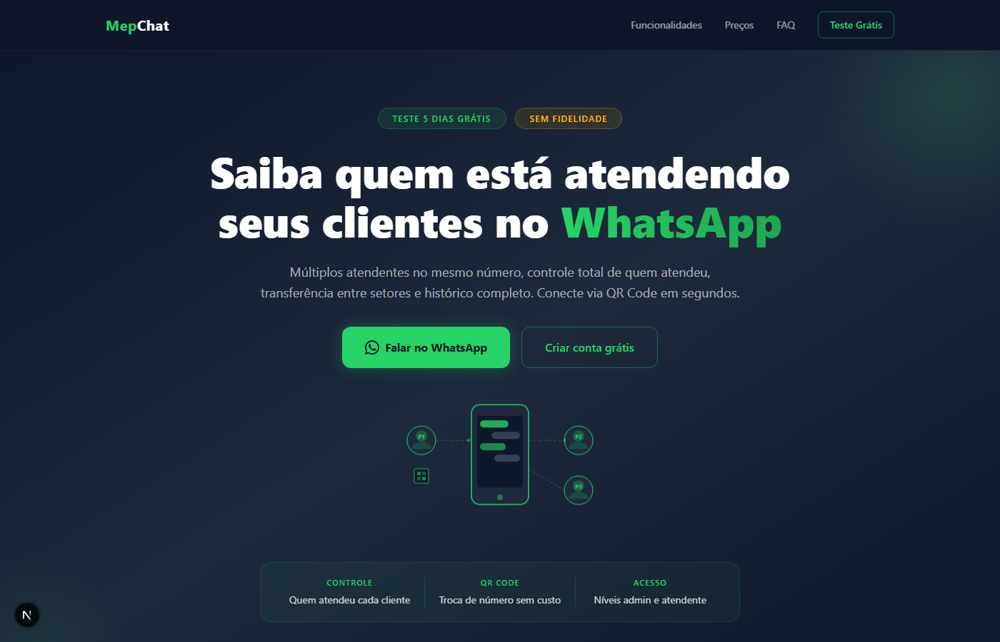

<div align="center">

# <span style="color:#25D366">Mep</span>Chat

### Atendimento WhatsApp com Multiplos Atendentes

[](https://nextjs.org/)
[](https://www.typescriptlang.org/)
[](https://tailwindcss.com/)
[](https://vercel.com/)

[Demo](https://mepchat-landing.vercel.app) | [Cadastro](https://mepchat.agenciamep.com/cadastro) | [WhatsApp](https://wa.me/5511914826568)

---



</div>

## Sobre

**MepChat** e uma plataforma de atendimento via WhatsApp que permite multiplos atendentes no mesmo numero. Saiba quem atendeu cada cliente, transfira chats entre setores, troque de numero instantaneamente via QR Code e tenha controle total da sua operacao.

> Sem fidelidade. Sem contrato. CPF e CNPJ sem consulta. Teste 5 dias gratis.

---

## Preview

<div align="center">

| Desktop | Mobile |
|---------|--------|
|  |  |

</div>

<details>
<summary>Ver pagina completa</summary>


</details>

---

## Funcionalidades

| Recurso | Descricao |
|---------|-----------|
| **Multi-atendentes** | Ate 5 atendentes no mesmo numero simultaneamente |
| **Conexao QR Code** | Conecte em segundos, troque de numero sem custo |
| **Departamentos** | Organize por setores: vendas, suporte, financeiro |
| **Niveis de acesso** | Admin, supervisor e atendente com permissoes diferentes |
| **Kanban** | Organize atendimentos e atividades visualmente |
| **Relatorios** | Dashboard com metricas de atendimento e desempenho |
| **Fluxo de Bot** | Automatize respostas e direcione para o setor certo |
| **Respostas rapidas** | Templates prontos para agilizar o atendimento |

---

## Plano Comercial

```
Plano Starter ─── R$ 249/mes
├── 5 usuarios (admin + 4 atendentes)
├── 1 conexao WhatsApp (QR Code)
├── Kanban incluso
├── Departamentos e setores
├── Fluxo de Bot
├── Relatorios e dashboard
├── Treinamento completo
└── Suporte em horario comercial

Adicionais sob demanda:
├── Usuario extra ........... R$ 25/mes
├── Conexao QR extra ........ R$ 200/mes
├── Disparos de mensagem .... R$ 129/mes
├── Chat Interno ............ R$ 89/mes
├── Calendario eventos ...... R$ 139/mes
├── API do Sistema .......... R$ 129/mes
├── Gestao de grupos ........ R$ 99/mes
└── Discador de chamadas .... R$ 49/mes
```

---

## Tech Stack

```
Frontend
├── Next.js 16 (App Router)
├── React 19
├── TypeScript 5 (strict)
├── Tailwind CSS 4
└── Vercel (deploy)

SEO
├── Meta tags completas (OG + Twitter Cards)
├── Schema.org (FAQPage + SoftwareApplication)
├── sitemap.xml + robots.txt
└── Core Web Vitals otimizados

UI/UX
├── Design dark mode (#0f172a + #25D366)
├── Animacoes fade-in (Intersection Observer)
├── Counter animation nos stats
├── Glow pulsante nos CTAs
├── SVG illustrations animadas
└── Responsivo mobile-first
```

---

## Estrutura do Projeto

```
src/
├── app/
│   ├── globals.css           # Estilos globais + animacoes CSS
│   ├── layout.tsx            # Layout raiz com SEO completo
│   ├── page.tsx              # Composicao de todas as secoes
│   ├── robots.ts             # Configuracao robots.txt
│   └── sitemap.ts            # Configuracao sitemap.xml
│
└── components/
    ├── animate-on-scroll.tsx  # HOC de animacao com Intersection Observer
    ├── navbar.tsx             # Navbar sticky com blur + mobile menu
    ├── hero.tsx               # Hero com SVG animado + CTAs
    ├── stats.tsx              # Barra de stats com counter animation
    ├── problem.tsx            # Secao "O problema" (cards vermelhos)
    ├── solution.tsx           # Secao "A solucao" (cards verdes)
    ├── features.tsx           # Grid de funcionalidades (icones SVG)
    ├── how-it-works.tsx       # "Como funciona" em 3 passos
    ├── pricing.tsx            # Card de preco + addons
    ├── social-proof.tsx       # Depoimentos com fotos + estrelas
    ├── faq.tsx                # FAQ com accordion animado
    ├── cta-final.tsx          # CTA de fechamento
    ├── footer.tsx             # Footer
    └── json-ld.tsx            # Schema.org structured data
```

---

## Desenvolvimento

```bash
# Clonar o repositorio
git clone https://github.com/JE4NVRG/mepchat-landing.git
cd mepchat-landing

# Instalar dependencias
npm install

# Rodar em desenvolvimento
npm run dev

# Build de producao
npm run build

# Iniciar producao
npm start
```

---

## Links

| | URL |
|---|---|
| Site | [mepchat-landing.vercel.app](https://mepchat-landing.vercel.app) |
| Cadastro | [mepchat.agenciamep.com/cadastro](https://mepchat.agenciamep.com/cadastro) |
| Painel | [mepchat.agenciamep.com](https://mepchat.agenciamep.com) |
| WhatsApp | [11 91482-6568](https://wa.me/5511914826568) |

---

<div align="center">

Feito com dedicacao pela **Agencia MEP**

[](https://github.com/JE4NVRG)

</div>
